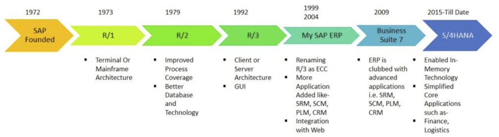
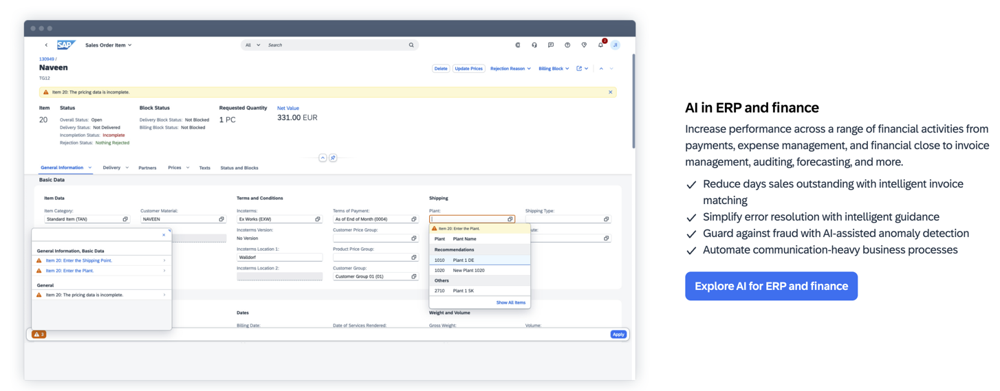
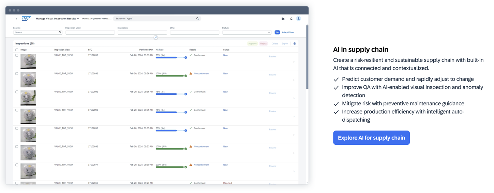
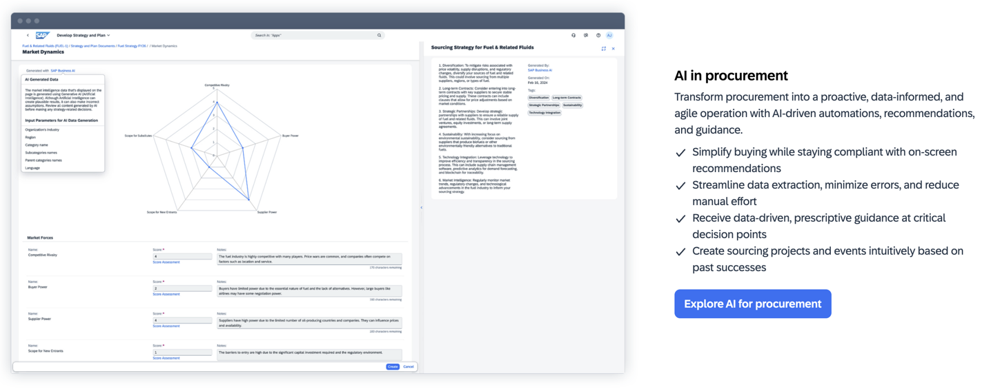
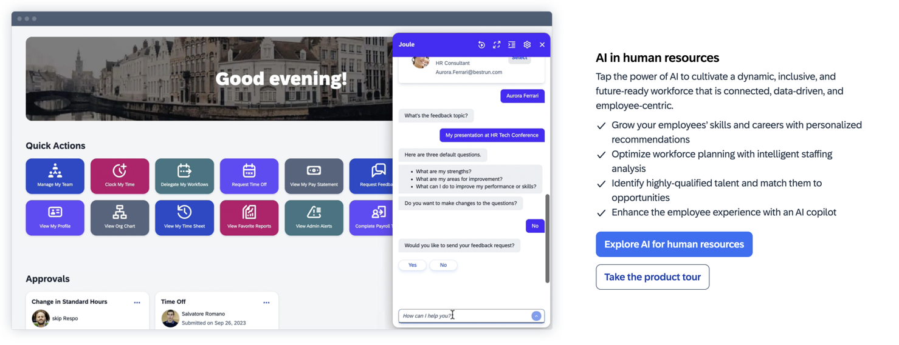
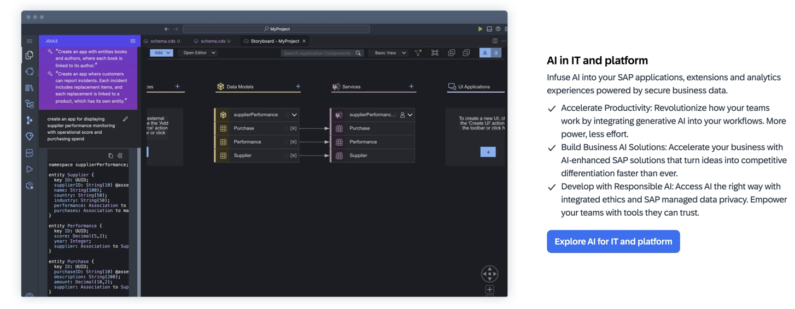
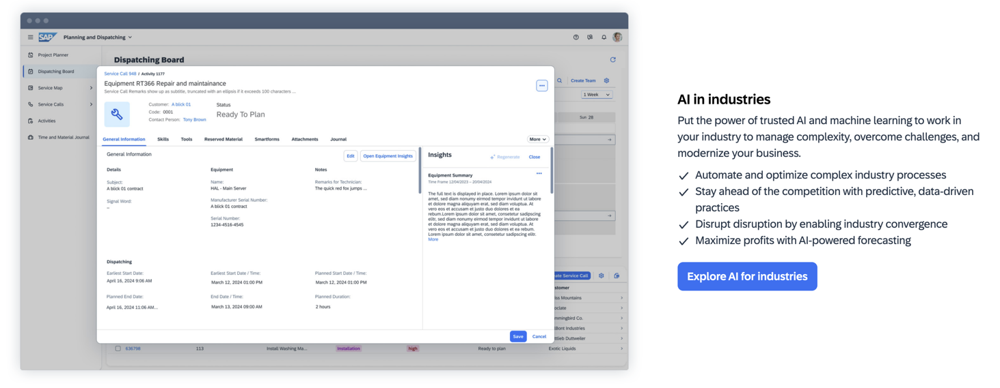
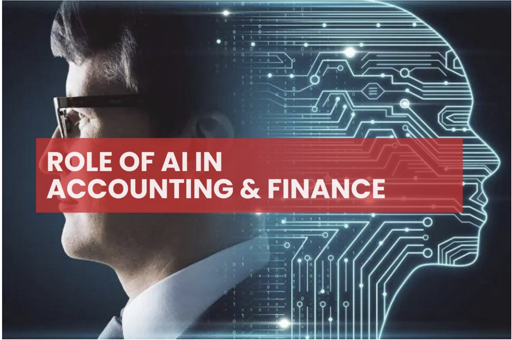
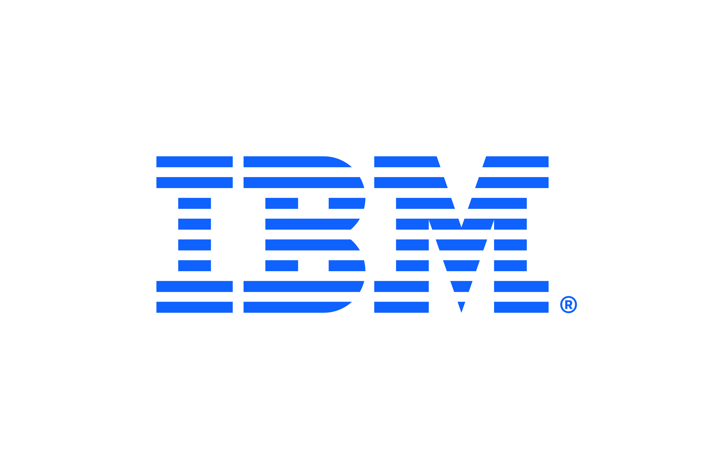
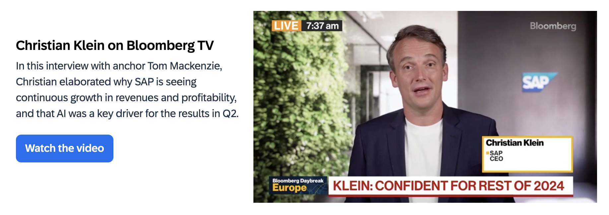

# ai-case-study

## Origin

<h2 align="center">

<a href="https://www.sap.com/index.html">

</h2>

[SAP History](https://www.sap.com/about/company/history.html) 

> On April 1, 1972, five former IBM employees - Dietmar Hopp, Hasso Plattner, Claus Wellenreuther, Klaus Tschira, and Hans-Werner Hector - started the company SystemAnalyse Programmentwicklung (System Analysis Program Development). Their idea was to create standard enterprise software that integrated all business processes and enabled data processing in real time.

> The name is an initialism of the company’s original German name: Systemanalyse Programmentwicklung, which translates to System Analysis Program Development. Today the company’s legal corporate name is SAP SE — SE stands for societas Europaea, a public company registered in accordance with the European Union corporate law.

> SAP helps companies and organizations of all sizes and industries run their businesses profitably, adapt continuously, and grow sustainably.

<h3 align="center">

</h3>

### [Timeline](https://skillstek.com/what-is-sap/)

<h4 align="center">

</h4>

### [Integration of Artificial Intelligence ("AI")](https://www.sap.com/investors/en/why-invest/investor-magazine/2023-q2/leitartikel.html#:~:text=SAP%20began%20embedding%20AI%20into,applications%20for%20the%20first%20time)

[Based on research by Goldman Sachs, "AI could drive a 7% increase in global GDP over a ten-year period."](https://www.key4biz.it/wp-content/uploads/2023/03/Global-Economics-Analyst_-The-Potentially-Large-Effects-of-Artificial-Intelligence-on-Economic-Growth-Briggs_Kodnani.pdf)

> SAP began embedding AI into its own application landscape through S/4HANA in the mid-2010s, making machine learning and chatbots available in enterprise applications for the first time. SAP's primary aim and strategy has always been to leverage technology to help solve specific problems and to simplify business processes. It wants humans to stay front and center and be empowered to make informed decisions. 

## [SAP Business AI](https://www.sap.com/products/artificial-intelligence.html)

> AI built to benefit a company across all its processes, no matter the industry or line of business.

### Core Business Processes

#### ERP and Finance

#### Supply Chain

#### Procurement

#### Human Resources

#### Sales and Marketing

#### IT and Platform

#### Industries

## [Generative AI](https://www.sap.com/products/artificial-intelligence/generative-ai.html)

> SAP AI solutions help your business to become more adaptive so you can deliver real-world results – whether it’s turning rigid processes into perceptive workflows, fragile supply chains into proactive ecosystems, or generic interactions into personalized experiences. 

> SAP's latest innovations in generative AI are tailored to optimize every facet of your business:
> 1. Gain insights into your business objects, such as purchase requisitions, and quickly navigate to applications for your work. Get precise answers to your questions and seamlessly access the content that matters to you with help from [Joule](https://www.sap.com/products/artificial-intelligence/ai-assistant.html).
> 2. Save time and improve efficiency by streamlining and automating HR processes with **Joule** (*see linked text above*).
> 3. Develop effective job descriptions that align with necessary skills, incorporate key terminology while avoiding unconscious bias, and automatically integrate essential content.
> 4. Accelerate strategy and planning processes across multiple categories with AI. Reduce onboarding time and reliance on more senior category managers, and gain time per category and adapt to market change with insight and agility. Use **Joule** (*see linked text above*) to create sourcing events in half the time versus with manual efforts.
> 5. Give your sales, service, and e-commerce teams access to AI from the platforms they use every day through a standalone app and **Joule** (*see linked text above*). You can combine business data with AI models to create more efficient teams and deliver exceptional experiences.
> 6. Get a turnkey environment for coding, testing, integrations, and application lifecycle management with **Joule's** (*see linked text above*) generative AI-based code development. Drive secure collaboration with unified governance and simplified application lifecycle management for professional and citizen developers.
> 7. Quickly identify the best-suited, ready-to-use process models and KPIs for the business with AI capabilities in SAP Signavio solutions. Reduce the need for consulting-heavy services, modelling workshops, and stakeholder interviews to identify the right processes and metrics.
> 8. Increase productivity by leveraging AI to generate descriptions of any fact sheet. Perform analysis with greater confidence by ensuring more complete data on your enterprise architecture. 
> 9. Enhance your sustainability reporting process with automated, AI-enabled ESG reporting integrated into SAP Sustainability Control Tower. Streamline the generation of periodic reports, freeing up valuable time on driving sustainability strategy and executing impactful programs.
> 10. Seamlessly chart business activities to sustainability factors using AI technology in SAP Sustainability Footprint Management. Gain agility and productivity by using AI to help map emission factors from life-cycle assessment (LCA) databases to ERP materials.
> 11. The consulting capabilities in **Joule** (*see linked text above*) draws insights from thousands of pages of SAP learning content, help, product documentation, and community content. SAP consultants can be more productive, while accessing the latest product and process details when working with end customers. 
> 12. The ABAP code generation capability in **Joule** (*see linked text above*) can help developers generate, complete, and explain code, as well as create software unit tests. This lets users spend more time building and deploying features rather than manually writing lines of code.

### [Customers Satisfaction](https://www.sap.com/products/artificial-intelligence.html?url_id=banner-glo-homepage-row1-cta-business-ai-240626)

| **Customer** | **SAP Impact** |
| ------- | ------- |
|  | 75% reduction in time spent on expenses |
|  | 80% increase in automatic cash processing |
|  | Building a skills-based organization|
|  | 1.6 terabytes of historical game data analyzed |
| | Significantly reduced planning process times |

## Landscape

SAP operates in the Software and IT Services Industry. This industry comprises various services and products that help organizations manage and optimize their information and business processes. The broader IT services market includes managed services, security services, data management, and cloud computing. 

SAP offers AI software solutions to the **Accounting and Finance Industries**. This includes analyzing large volumes of accounts receivable data in determining working capital, enriching planning modes with historical data from source systems to enable fast decision making, simplifying the complexities of predictive analytics, making the financial close more efficient, automating tax compliance, and policy audits.

### Accounting and Finance Industry Trends
1. **Artificial Intelligence and Machine Learning** - Automation can be achieved through software like robotic process automation (RPA), which uses artificial intelligence (AI) bots to complete repetitive tasks quickly and accurately. It can even play a role in analyzing documents and preparing reports. Not only will this save your firm time and money, but it will also free up employees' time so they can focus on higher impact and higher-value activities. [@Yanchycki (2024)](https://contentsnare.com/top-accounting-trends/)
2. **Blockchain in Accounting** - For years, blockchain technology has been synonymous with cryptocurrencies. Regardless of how you view crypto, blockchain has the potential to revolutionize how businesses document transactions and preserve records. It offers better security, transparency, and efficiency than any other digital recordkeeping solution and is something you should explore to boost the trustworthiness of financial reports. [@Controllers Council (2023)](https://controllerscouncil.org/top-12-accounting-trends-in-2024-navigating-the-future-of-finance/)
3. **Cloud Computing** - Cloud computing has become the backbone of modern accounting systems. Its flexibility, scalability, and cost-effectiveness make it an ideal choice for your business, regardless of size. Going full-cloud allows you to access data from anywhere and in real-time, ensuring you have up-to-the-minute insights. [@Controllers Council (2023)](https://controllerscouncil.org/top-12-accounting-trends-in-2024-navigating-the-future-of-finance/) 
4. **Cybersecurity and Data Privacy** - As more data is shared electronically between accounting firms and their clients, hackers are also stepping up their games. Accounting firms need to protect themselves from cyber threats and other data security issues, including offering adequate cybersecurity training to their employees. [@Yanchycki (2024)](https://contentsnare.com/top-accounting-trends/) 
5. **Data Analytics** - Data analytics help identify operational inefficiencies and manage risks better. More businesses will invest in data analysis to help with data-backed decisions. Accounting firms can analyze their client's historical performance data to create forecasts for the future. Forecasts allow companies to plan, so they can make more informed decisions when it comes time for critical business choices. [@Yanchycki (2024)](https://contentsnare.com/top-accounting-trends/) 
6. **Big Data** - Big data is a term used to describe the large volume of data organizations collect from various sources. Accounting firms need to find ways to store this data, mine it for insights, and turn it into actionable knowledge to remain competitive. [@Yanchycki (2024)](https://contentsnare.com/top-accounting-trends/)

### Role of AI in Accounting and Finance

<h5 align="center">

</h5>

### Future Uses of AI in the Accounting and Finance Industries

1. Processing expenses
2. Data analysis 
3. Fraud detection
4. Business intelligence and decision-making
5. Pricing analysis
6. Forecasting 
7. Scheduling
8. Financial, regulatory, and business research
9. AI-assisted scenario generation for strategic planning
10. Auditing
11. Business communications

### [Major Competitors](https://www.gartner.com/reviews/market/analytics-business-intelligence-platforms/vendor/sap/alternatives)

-----

-----

-----

-----

-----

-----

-----

-----

-----

## Results

### [Impact on the Software and IT Services Industry](https://www.sap.com/investors/en/why-invest/investor-magazine/2023-q2/leitartikel.html#:~:text=SAP%20began%20embedding%20AI%20into,applications%20for%20the%20first%20time)

> SAP has changed the Software and IT Services Industry over the last fifty plus years and has consistently sought to drive positive change through technological innovation, helping companies all over the world transform their business models, focus on sustainability, and improve their productivity. SAP began embedding AI into its own application landscape in the mid-2010s. 

> AI has a great many practical applications, and takes many forms. No single AI tool can solve every problem, and SAP clearly distinguishes which of the tools provides the best result for a given use case. Its extensive expertise and industry know-how, paired with an in-depth knowledge of business processes, put SAP miles ahead of the competition: it has already integrated more than 130 AI innovations and functions into its applications. These are currently being leveraged by upwards of 24,000 customers across multiple scenarios – though users are mostly unaware that AI is helping them with their everyday tasks.

> SAP recently launched SAP Business AI that is developed using SAP’s deep process knowledge and a global pool of industry-specific data, customers using cloud applications from SAP stand to benefit from it enormously. SAP Business AI is therefore a key component of all SAP business applications in the cloud. It is designed to be a reliable partner that supports and enhances the human experience. Leveraging the new capabilities AI delivers, our customers will gain credible insights into their processes and be empowered to automate them more easily – in finance, logistics, procurement, sales, and human resources.

>“Generative artificial intelligence” has been on everyone's lips over the last year or so. It’s the next big thing in technology. SAP is currently exploring a host of use cases and ideas that leverage this new technology, with the main aim being to infuse our product portfolio with AI to make it even more powerful and valuable for customers.

### [Business Performance in 2023](https://www.sap.com/investors/en/why-invest/investor-magazine/2023-q2/geschaeftsentwicklung.html)

> SAP’s cloud offerings, and especially RISE with SAP, continued to resonate well with customers and to drive revenue growth. SAP successfully completed a migration of the cloud customer base to a state-of-the-art, harmonized cloud infrastructure, also improved our profitability. Going forward, the cloud business is expected to receive an additional boost through greater use of artificial intelligence (AI), with the potential to nearly double the addressable market.

> To support this goal, SAP has not only entered into joint projects with Google, IBM Watson, and Microsoft, but has also made strategic investments in leading generative AI companies Aleph Alpha, Anthropic, and Cohere. Sapphire Ventures, too, has committed to investing over US$1 billion in AI-powered enterprise technology startups.

> Total revenue grew in the first half of 2023 (see the table on page 5) due to the strong momentum in our cloud business, while software license revenue declined over that period. Within cloud revenue, SAP S/4HANA cloud revenue is up 76% to €1.54 billion. Software licenses revenue fell by a further 20% to €0.59 billion. The share of more predictable revenue increased by one percentage point to 82% in the first half of 2023.

### [Business Performance in 2024](https://www.sap.com/investors/en/why-invest/recent-results.html)

#### At a Glance
> - Current cloud backlog of €14.8 billion, up 28%, both at nominal and constant currencies
> - Cloud revenue up 25%, underpinned by 33% Cloud ERP Suite revenue growth, all at nominal and constant currencies
> - Total revenue up 10%, both at nominal and constant currencies
> - IFRS cloud gross profit up 29%, non-IFRS cloud gross profit up 28% and up 29% at constant currencies
> - IFRS operating profit down 11% due to restructuring expenses of €0.6 billion. Non-IFRS operating profit up 33% and up 35% at constant currencies
> - 2024 financial outlook reiterated. 2025 operating profit ambition increased to reflect anticipated incremental efficiency gains from expanded transformation program

<h6 align="center">

</h6>

## Recommendations

SAP is the preeminent ERP provider on the market. It is versatile and among the most feature-rich ERP offerings on the market. SAP has ERPs solutions in multiple options, each tailored to meet the needs of providing small and large enterprises alike with all the warehouse management, real-time reporting/analytics/forecasting, finance and accounting, workflow automation, CRM, HR and manufacturing features that you’d need to drive your business. [@Davis (2024)](https://www.forbes.com/advisor/business/software/sap-competitors/)

Compared to its competitors: [@Davis (2024)](https://www.forbes.com/advisor/business/software/sap-competitors/)
- SAP commands a higher price as it is the preeminent solutions provider. As a result, competitors can meet or even exceed the capabilities of SAP but at a **cost**. 
- SAP is particularly vast and will require more time and attention from your IT team. SAP is more **sophisticated** to set up, use and administer compared to top SAP competitors.
-  SAP has some limitations when it comes to supply chain management features. Business One is a fully featured ERP solution, but it’s not the strongest in every area compared to SAP competitors.

### Cost

Cost vs. savings: ERP solutions aren’t cheap but, if you do it right, they should pay for themselves. When you are creating an ERP budget, take into consideration how much savings it creates vs. how much it costs to use. If an ERP can pay for itself, then you can justify seemingly high costs. Sometimes the expensive solution might have a more bountiful and faster return on investment (ROI). [@Davis (2024)](https://www.forbes.com/advisor/business/software/sap-competitors/)

### Complexity

IT environment: If you don’t have an IT department or it is currently stretched too thin, then SAP might not be the wisest choice. Many SAP competitors offer hosted ERPs, so you don’t have to purchase additional IT equipment or allocate more labor to support it. [@Davis (2024)](https://www.forbes.com/advisor/business/software/sap-competitors/)

### Supply Chain

Vertical market: SAP is not as well suited for businesses that have to deal with supply chain management and logistics as SAP competitors.(https://www.forbes.com/advisor/business/software/sap-competitors/)

## [SAP Learning](https://learning.sap.com/)

SAP offers various options to understand how to use the software best suited for your company:
1. [Former openSAP courses](https://learning.sap.com/courses?page=1&subtype=mooc-content&url_id=text-lsc-homepage)
2. [Content for SAP partners](https://learning.sap.com/partners)
3. [SAP Learning Hub](https://www.sap.com/training-certification/learning-hub.html)
4. [SAP Certifications](https://learning.sap.com/certification-transformation)

## Sources

[SAP](https://www.sap.com/index.html)

[Timeline](https://skillstek.com/what-is-sap/)
[Integration of AI](https://www.sap.com/investors/en/why-invest/investor-magazine/2023-q2/leitartikel.html#:~:text=SAP%20began%20embedding%20AI%20into,applications%20for%20the%20first%20time)

Accounting and Finance Industry Trends
1. [Controllers Council](https://controllerscouncil.org/top-12-accounting-trends-in-2024-navigating-the-future-of-finance/)
2. [Future of accounting: Top 11 accounting trends](https://contentsnare.com/top-accounting-trends/)

Future Uses of AI in the Accounting and Finance Industries
1. [Navigating AI’s Impact on Accounting: Uses, Trends and Tools](https://tipalti.com/accounting-hub/ai-accounting/)
2. [Guide to AI in accounting: Trends, tools, and stats](https://karbonhq.com/resources/ai-in-accounting/)
3. [2024 and Beyond: The Impact of AI on the Future of Accounting](https://www.focuspeople.com/2024/02/07/2024-and-beyond-the-impact-of-ai-on-the-future-of-accounting/#:~:text=AI%20is%20changing%20the%20work,skills%20to%20use%20AI%20properly.)

[Role of AI in Accounting and Finance](https://innovatureinc.com/role-of-ai-in-accounting-and-finance/)

Competitors
1. [Forbes](https://www.forbes.com/advisor/business/software/sap-competitors/#:~:text=There%20are%20many%20SAP%20competitors,about%20the%20best%20ERP%20systems.)
2. [Gartner](https://www.gartner.com/reviews/market/analytics-business-intelligence-platforms/vendor/sap/alternatives)

Results
1. [SAP Cover Story](https://www.sap.com/investors/en/why-invest/investor-magazine/2023-q2/leitartikel.html#:~:text=SAP%20began%20embedding%20AI%20into,applications%20for%20the%20first%20time)
2. [Goldman Sachs Research](https://www.key4biz.it/wp-content/uploads/2023/03/Global-Economics-Analyst_-The-Potentially-Large-Effects-of-Artificial-Intelligence-on-Economic-Growth-Briggs_Kodnani.pdf)
3. [SAP Invests $1.1B to Become Leader in Business AI](https://accelerationeconomy.com/cloud-wars/cloud-wars-minute/sap-invests-1-1b-to-become-leader-in-business-ai/)
4. [2023 Results](https://www.sap.com/investors/en/why-invest/investor-magazine/2023-q2/geschaeftsentwicklung.html)
5. [2024 Results](https://www.sap.com/investors/en/why-invest/recent-results.html)
6. [Bloomberg Interview](https://www.bloomberg.com/news/videos/2024-07-23/sap-shares-rise-as-cloud-revenue-growth-sustains)

Recommendations
1. [Top SAP Competitors (2024)](https://www.forbes.com/advisor/business/software/sap-competitors/)