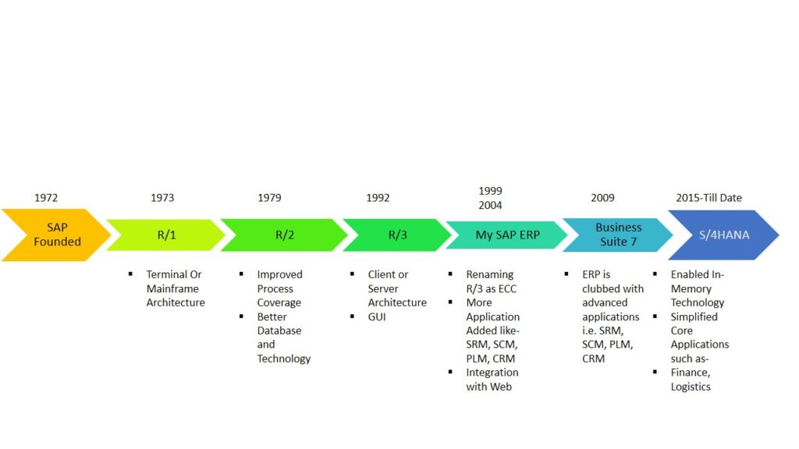
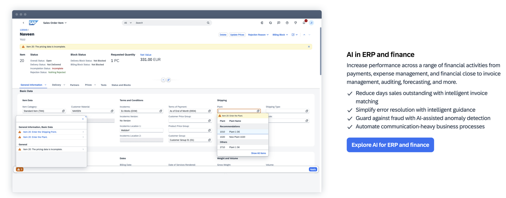
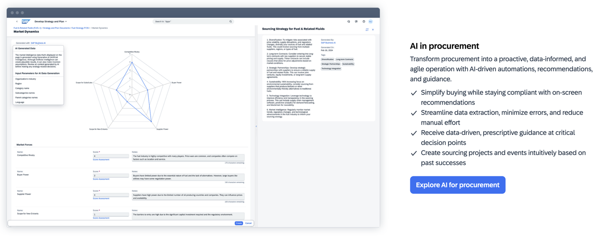
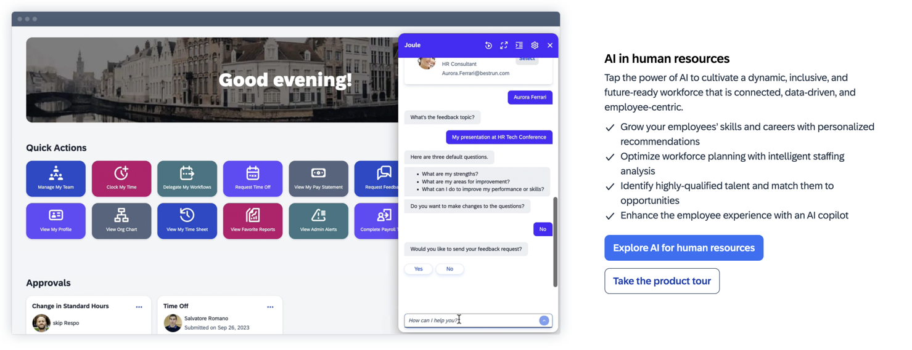
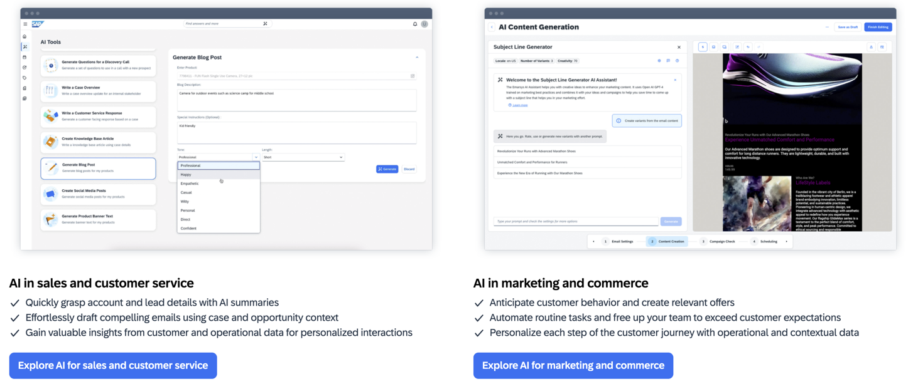
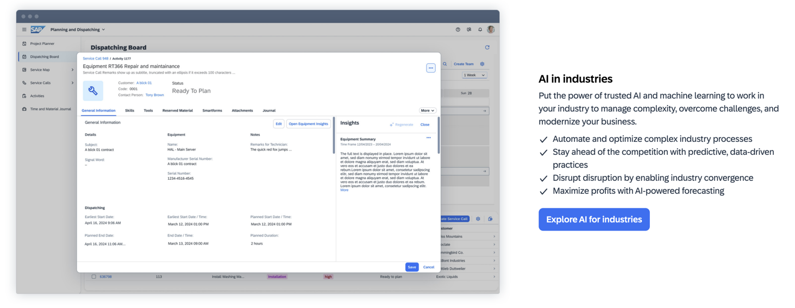
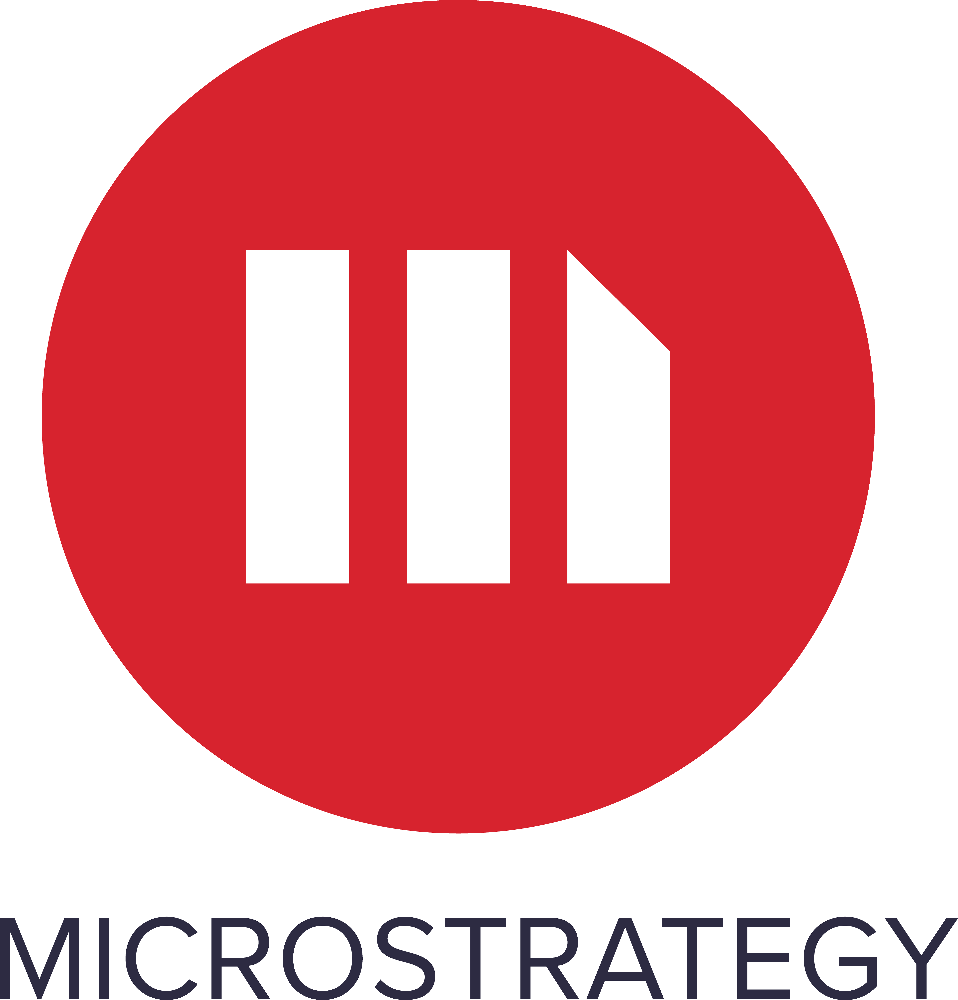
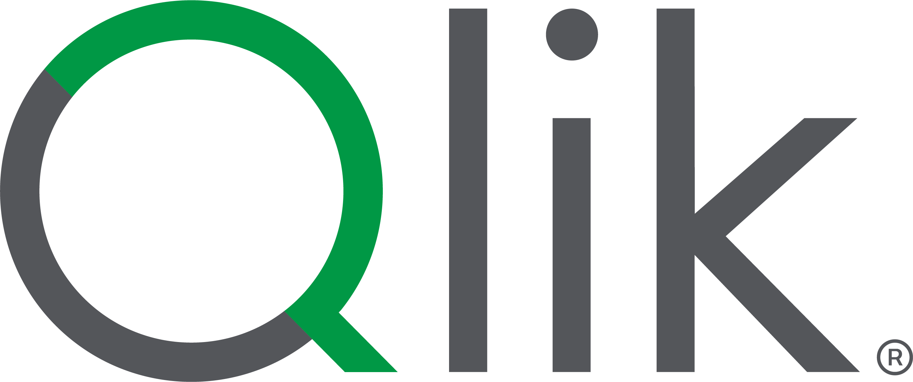

# ai-case-study

## Origin

<h2 align="center">

<a href="https://www.sap.com/index.html">

</h2>

[SAP History](https://www.sap.com/about/company/history.html) 

> On April 1, 1972, five former IBM employees - Dietmar Hopp, Hasso Plattner, Claus Wellenreuther, Klaus Tschira, and Hans-Werner Hector - started the company SystemAnalyse Programmentwicklung (System Analysis Program Development). Their idea was to create standard enterprise software that integrated all business processes and enabled data processing in real time.

> The name is an initialism of the company’s original German name: Systemanalyse Programmentwicklung, which translates to System Analysis Program Development. Today the company’s legal corporate name is SAP SE — SE stands for societas Europaea, a public company registered in accordance with the European Union corporate law.

> SAP helps companies and organizations of all sizes and industries run their businesses profitably, adapt continuously, and grow sustainably.

<h3 align="center">

</h3>

### Timeline

<h4 align="center">

</h4>

## [SAP Business AI](https://www.sap.com/products/artificial-intelligence.html)

AI built to benefit a company across all processes.

### Core Business Processes

#### ERP and Finance

#### Supply Chain

#### Procurement

#### Human Resources

#### Sales and Marketing

#### IT and Platform

#### Industries

### [Joule](https://www.sap.com/products/artificial-intelligence/ai-assistant.html)

[Joule](Joule.pdf) is revolutionizing how you interact with your SAP business systems:
1. [Streamline and automate sourcing events](https://www.sap.com/products/spend-management/category-management-software.html#gen-ai)
2. [Accelerate audience segmentations](https://www.sap.com/products/crm/customer-data-platform.html)
3. [Drive intelligent HR self-service capabilities](https://www.sap.com/products/hcm/ai-joule-product-tour.html)
4. [Smart features for planning and analytics](https://www.sap.com/products/technology-platform/cloud-analytics/features/generative-ai.html)
5. [Level up developer productivity](https://www.sap.com/products/technology-platform/developer-tools.html)
6. [Maximize the efficiency of your business operations](https://www.sap.com/products/erp/s4hana/innovations.html)
7. [Help sales reps find the optimal product configurations](https://www.sap.com/assetdetail/2024/05/88cc6321-c07e-0010-bca6-c68f7e60039b.html)
8. [Configure and manage your SAP BTP applications, services, and subaccounts](https://www.sap.com/products/artificial-intelligence/business-technology-platform.html)
9. [Analyze supply chain performance and suggest improvements](https://www.sap.com/products/artificial-intelligence/supply-chain.html#plan)

### 

| **Customer** | **SAP Impact** |
| ------- | ------- |
|  | 75% reduction in time spent on expenses |
|  | 80% increase in automatic cash processing |
|  | Building a skills-based organization|
|  | 1.6 terabytes of historical game data analyzed |
| | Significantly reduced planning process times |

## Landscape

SAP operates in the Software and IT Services Industry. This industry comprises various services and products that help organizations manage and optimize their information and business processes. The broader IT services market includes managed services, security services, data management, and cloud computing. 

SAP offers AI software solutions to the **Accounting and Finance Industries**. This includes analyzing large volumes of accounts receivable data in determining working capital, enriching planning modes with historical data from source systems to enable fast decision making, simplifying the complexities of predictive analytics, making the financial close more efficient, automating tax compliance, and policy audits.

### Accounting and Finance Industry Trends
1. **Artificial Intelligence and Machine Learning** - Automation can be achieved through software like robotic process automation (RPA), which uses artificial intelligence (AI) bots to complete repetitive tasks quickly and accurately. It can even play a role in analyzing documents and preparing reports. Not only will this save your firm time and money, but it will also free up employees' time so they can focus on higher impact and higher-value activities.
2. **Blockchain in Accounting** - 
3. **Cloud Computing** - 
4. **Cybersecurity and Data Privacy** - 
5. **Shift Toward Sustainable Accounting** - 
6. **Data Analytics** - 
7. **Big Data** - 
8. **Statutory and Regulatory Compliance** - 
9. **Remote Work** - The traditional workforce is changing. Employees are no longer bound to a physical office, and businesses are taking advantage of this. The accounting industry is no exception and is one industry that can do it more easily than others.[@Yanchycki (2024)](https://contentsnare.com/top-accounting-trends/)

### Major Competitors

-----

-----

-----

-----

-----

-----

-----

-----

-----

### Customers Satisfaction

### Customers Satisfaction

### Customers Satisfaction

## Results

## [Learning](https://learning.sap.com/)

SAP offers various options to understand how to use the software best suited for your company:
1. [Former openSAP courses](https://learning.sap.com/courses?page=1&subtype=mooc-content&url_id=text-lsc-homepage)
2. [Content for SAP partners](https://learning.sap.com/partners)
3. [SAP Learning Hub](https://www.sap.com/training-certification/learning-hub.html)
4. [SAP Certifications](https://learning.sap.com/certification-transformation)
